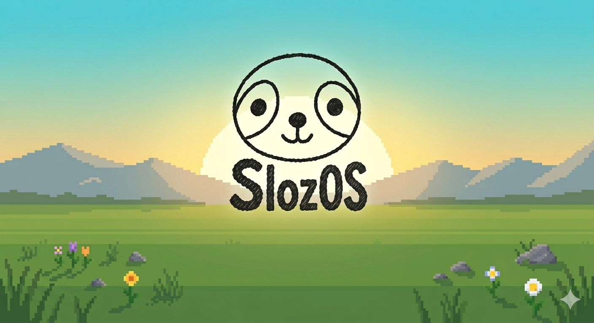

<div align="center">


# SlozOS

**A custom gaming OS for the Microsoft Surface Pro 2 — built on Bazzite**

[](https://github.com/JackachuYT/SlozOS/actions/workflows/build.yml)


</div>

---

## What is SlozOS?

SlozOS is a bootable gaming Linux distribution tailor-made for the **Microsoft Surface Pro 2**. It combines the rock-solid gaming foundation of **Bazzite** (by Universal Blue) with the **linux-surface kernel** for full Surface hardware support — touchscreen, stylus, camera, type cover — all out of the box.

---

## Built on Bazzite 🎮

<div align="center">


*Bazzite — the best gaming desktop Linux, now on your Surface*

</div>

Bazzite brings:
- 🎮 **Steam + Gamescope** pre-installed
- 🖥️ **KDE Plasma** desktop with gaming tweaks
- 🔄 **Immutable OS** — updates never break your system
- 🧩 **Flatpak-first** apps via Discover
- ⚡ **FSR, MangoHud, Lutris** all ready to go

---

## The Device — Microsoft Surface Pro 2

<div align="center">


*Microsoft Surface Pro 2 — given new life as a gaming tablet*

</div>

| Spec | Details |
|------|---------|
| CPU | Intel Core i5-4300U (Haswell) |
| GPU | Intel HD Graphics 4400 |
| RAM | 4 GB / 8 GB LPDDR3 |
| Storage | 64 / 128 / 256 / 512 GB SSD |
| Display | 10.6" 1920×1080 IPS touchscreen |
| Kernel | `linux-surface` (patched for Surface hardware) |

---

## SlozOS Wallpaper Preview

<div align="center">



</div>

---

## How to Install

### Step 1 — Download the ISO

1. Go to the [**Actions tab**](https://github.com/JackachuYT/SlozOS/actions)
2. Click the latest successful **Build SlozOS ISO** run
3. Scroll to the bottom and download **SlozOS-ISO**
4. Unzip it — you'll get `SlozOS-1.0-amd64.iso`

---

### Step 2 — Flash to USB

Use **[Balena Etcher](https://etcher.balena.io/)** (free, works on Mac/Windows/Linux):

1. Download and open Balena Etcher
2. Click **Flash from file** → select `SlozOS-1.0-amd64.iso`
3. Click **Select target** → choose your USB drive (8 GB+)
4. Click **Flash!** and wait for it to finish

> ⚠️ This will erase everything on the USB drive.

---

### Step 3 — Boot the Surface Pro 2 from USB

1. Plug the USB into your Surface Pro 2
2. Hold **Volume Down** and press the **Power** button
3. The Surface UEFI / boot menu will appear
4. Select your USB drive to boot from it
5. SlozOS installer will launch automatically

---

### Step 4 — Install

1. Follow the on-screen installer (language, disk, username)
2. When asked which disk, select your Surface's internal SSD
3. Let it install (~10 minutes)
4. Remove the USB when prompted and reboot
5. Welcome to SlozOS 🎉

---

## What's Included

| Feature | Status |
|---------|--------|
| linux-surface kernel | ✅ |
| Touchscreen support | ✅ |
| Surface Pen / stylus | ✅ |
| Type Cover keyboard | ✅ |
| Wi-Fi & Bluetooth | ✅ |
| Steam (Flatpak) | ✅ |
| KDE Plasma desktop | ✅ |
| SlozOS branding & theme | ✅ |
| SDDM login theme | ✅ |

---

## Building Locally

The ISO is built automatically via GitHub Actions. If you want to build it yourself (Linux x86_64 with podman):

```bash
# Build the OS image
sudo podman build -t localhost/slozos:latest -f build/Containerfile .

# Generate the ISO
mkdir -p output
sudo podman run --rm --privileged \
  -v /var/lib/containers/storage:/var/lib/containers/storage \
  -v "$(pwd)/output:/output" \
  quay.io/centos-bootc/bootc-image-builder:latest \
  --type iso --local localhost/slozos:latest
```

---

## Credits

- [**Bazzite**](https://bazzite.gg) by Universal Blue — the best gaming Linux distro
- [**linux-surface**](https://github.com/linux-surface/linux-surface) — Surface kernel patches
- [**bootc-image-builder**](https://github.com/osbuild/bootc-image-builder) — ISO generation

---

<div align="center">

Made with ❤️ by [JackachuYT](https://github.com/JackachuYT)

</div>
