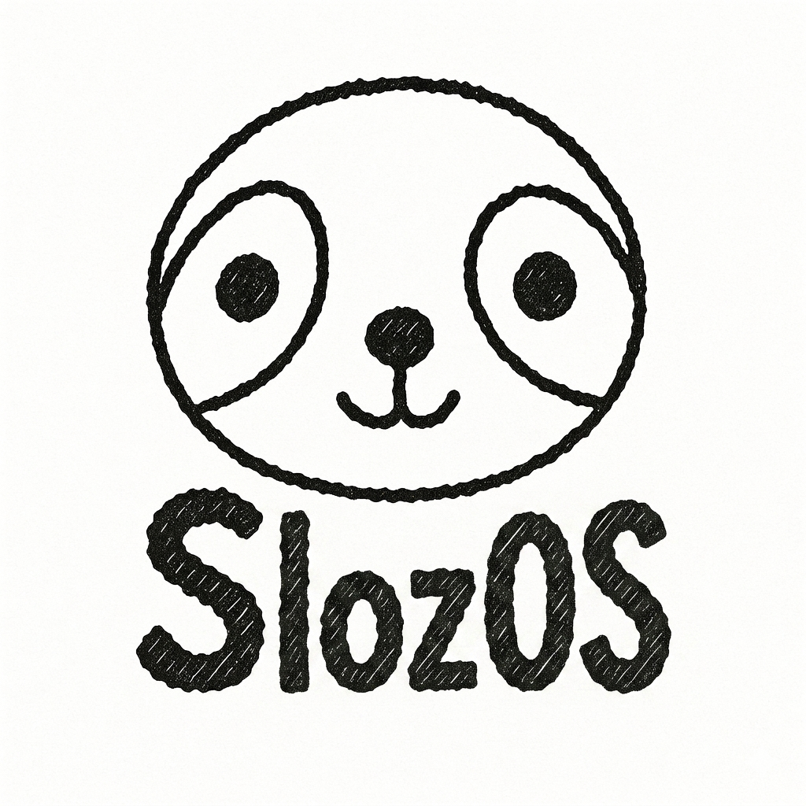

<div align="center">



# SlozOS

**A custom gaming OS for Microsoft Surface Pro 1, 2 and Surface Book 1 — built on Bazzite**
Sorry everyone! I didn't reallise I was commiting from my GitHub alt account so if you see JackachuCode, thats just me xD

[](https://github.com/JackachuYT/SlozOS/actions/workflows/build.yml)


</div>

---

## What is SlozOS?

SlozOS is a bootable gaming Linux distribution built on **[Bazzite](https://bazzite.gg)** (by Universal Blue), tuned specifically for Microsoft Surface hardware. Bazzite's kernel already ships with Surface support baked in — touchscreen, stylus, type cover, and Surface aggregator modules all auto-load at boot.

---

## Built on Bazzite 🎮

<div align="center">


*Bazzite — the best gaming desktop Linux, now on your Surface*


*Bazzite Game Mode — Steam Big Picture on your Surface*

</div>

Bazzite brings:
- 🎮 **Steam + Gamescope** pre-installed
- 🖥️ **KDE Plasma** desktop with gaming tweaks
- 🔄 **Immutable OS** — updates never break your system
- 🧩 **Flatpak-first** apps via Discover
- ⚡ **FSR, MangoHud, Lutris** all ready to go

---

## Supported Devices

SlozOS comes in three editions — one for each supported Surface device:

---

### 🟦 SlozOS SP2 — Surface Pro 2

<div align="center">


*Microsoft Surface Pro 2 (2013) — given new life as a gaming tablet*
</div>

| Spec | Details |
|------|---------|
| CPU | Intel Core i5-4300U (Haswell) |
| GPU | Intel HD Graphics 4400 |
| RAM | 4 GB / 8 GB LPDDR3 |
| Storage | 64 – 512 GB SSD |
| Display | 10.6" 1920×1080 IPS touchscreen |
| Base image | `bazzite:stable` |

| Feature | Status |
|---------|--------|
| Keyboard / Type Cover | ✅ |
| Touchscreen | ✅ |
| Surface Pen | ✅ |
| WiFi (Marvell 88W8797 USB) | ✅ |
| Bluetooth | ✅ |
| Front + rear cameras | ✅ |
| Audio / microphone | ✅ |
| Brightness | ✅ |
| Suspend (lid-loop fix) | ✅ |
| Performance Modes | ❌ |

[**⬇ Download SlozOS 1.0 SP2**](https://github.com/JackachuYT/SlozOS/releases/tag/v1.0-sp2)

---

### 🟩 SlozOS SP1 — Surface Pro 1

<div align="center">


*Microsoft Surface Pro 1 (2013) — the original, still gaming*
</div>

| Spec | Details |
|------|---------|
| CPU | Intel Core i5-3317U (Ivy Bridge) |
| GPU | Intel HD Graphics 4000 |
| RAM | 4 GB LPDDR3 |
| Storage | 64 / 128 GB SSD |
| Display | 10.6" 1920×1080 IPS touchscreen |
| Base image | `bazzite:stable` |

| Feature | Status |
|---------|--------|
| Keyboard / Type Cover | ✅ |
| Touchscreen | ✅ |
| Surface Pen | ✅ |
| WiFi (Marvell USB) | ✅ |
| Bluetooth | ✅ |
| Both cameras | ✅ |
| Audio / microphone | ✅ |
| Suspend (lid-loop fix) | ✅ |
| Sensors & Battery | ✅ |
| Performance Modes | ❌ |

[**⬇ Download SlozOS 1.0 SP1**](https://github.com/JackachuYT/SlozOS/releases/tag/v1.0-sp1)

---

### 🟧 SlozOS SB1 — Surface Book 1

<div align="center">


*Microsoft Surface Book 1 (2015) — NVIDIA gaming power in a clipboard laptop*
</div>

| Spec | Details |
|------|---------|
| CPU | Intel Core i5-6300U / i7-6600U (Skylake) |
| iGPU | Intel HD Graphics 520 |
| dGPU | NVIDIA GeForce GTX 940M (keyboard base) |
| RAM | 8 / 16 GB LPDDR3 |
| Storage | 128 – 512 GB SSD |
| Display | 13.5" 3000×2000 PixelSense touchscreen |
| Base image | `bazzite-nvidia:stable` |

| Feature | Status |
|---------|--------|
| Keyboard & Touchpad | ✅ |
| Tablet Mode / Touchscreen | ✅ |
| Surface Pen | ✅ |
| WiFi (Marvell 88W8897 PCIe) | ✅ |
| Bluetooth | ✅ |
| Dedicated GPU (GTX 940M via PRIME) | ✅ |
| Clipboard Detachment | ✅ |
| Audio, Sensors, Battery | ✅ |
| Suspend / Hibernate | ✅ |
| Cameras | ❓ |
| Performance Modes | ❌ |

[**⬇ Download SlozOS 1.0 SB1**](https://github.com/JackachuYT/SlozOS/releases/tag/v1.0-sb1)

---

## How to Install

### Step 1 — Download your edition

Each edition is split into 1900 MB parts (GitHub's 2 GiB per-file limit). Download all parts for your device into one folder, then reassemble:

| Edition | Release |
|---------|---------|
| Surface Pro 2 | [v1.0-sp2](https://github.com/JackachuYT/SlozOS/releases/tag/v1.0-sp2) → `SlozOS-1.0-SP2-amd64.7z.001/002/003` |
| Surface Pro 1 | [v1.0-sp1](https://github.com/JackachuYT/SlozOS/releases/tag/v1.0-sp1) → `SlozOS-1.0-SP1-amd64.7z.001/002/003` |
| Surface Book 1 | [v1.0-sb1](https://github.com/JackachuYT/SlozOS/releases/tag/v1.0-sb1) → `SlozOS-1.0-SB1-amd64.7z.001/002/003` |

Reassemble with [7-Zip](https://www.7-zip.org/):
- **Windows:** right-click the `.001` file → 7-Zip → Extract Here
- **Linux/macOS:** `7z x SlozOS-1.0-SP2-amd64.7z.001` (swap SP2 for your edition)

---

### Step 2 — Flash to USB

Use **[Balena Etcher](https://etcher.balena.io/)** (free, works on Mac/Windows/Linux):

1. Open Balena Etcher
2. Click **Flash from file** → select your `.iso`
3. Click **Select target** → choose your USB drive (8 GB+)
4. Click **Flash!** and wait

> ⚠️ This will erase everything on the USB drive.

---

### Step 3 — Boot from USB

1. Plug the USB into your Surface
2. Hold **Volume Down** and press the **Power** button
3. Select your USB drive in the boot menu
4. The SlozOS installer launches automatically

---

### Step 4 — Install

1. Follow the on-screen Anaconda installer (language, disk, username)
2. Under **Installation Destination**, select your Surface's internal SSD
3. Let it install (~10 minutes)
4. Remove the USB when prompted and reboot
5. Welcome to SlozOS 🎉

---

## Building Locally

ISOs are built automatically via GitHub Actions on every push to `main`. To build yourself (Linux x86_64 with podman):

```bash
# SP2 (Intel only)
sudo podman build -t localhost/slozos-sp2:latest -f build/Containerfile.sp2 .

# SP1 (Intel only)
sudo podman build -t localhost/slozos-sp1:latest -f build/Containerfile.sp1 .

# SB1 (Intel + NVIDIA)
sudo podman build -t localhost/slozos-sb1:latest -f build/Containerfile.sb1 .

# Generate ISO (swap image tag as needed)
sudo podman run --rm --privileged \
  -v /var/lib/containers/storage:/var/lib/containers/storage \
  -v "$(pwd)/output:/output" \
  quay.io/centos-bootc/bootc-image-builder:latest \
  --type iso --rootfs btrfs --local localhost/slozos-sp2:latest
```

---

## Credits

- [**Bazzite**](https://bazzite.gg) by Universal Blue — the best gaming Linux distro
- [**linux-surface**](https://github.com/linux-surface/linux-surface) — Surface kernel patches & feature matrix
- [**bootc-image-builder**](https://github.com/osbuild/bootc-image-builder) — ISO generation

---

<div align="center">

Made with ❤️ by [JackachuYT](https://github.com/JackachuYT)

</div>
