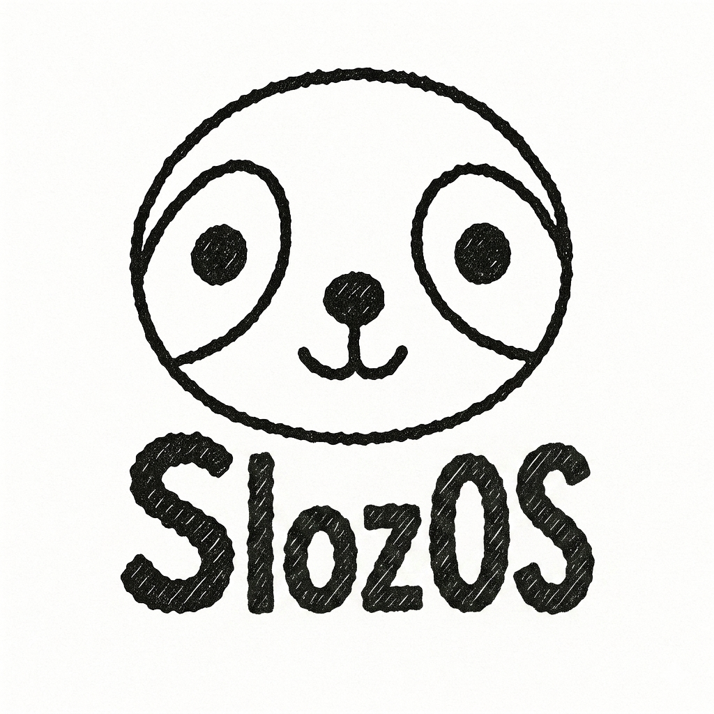

<div align="center">



# SlozOS

**A macOS Tahoe-style gaming OS for any PC — built on Bazzite**

🎉 **SlozOS 1.4.2 — touchscreen and game controller support, and smarter graphics, for every PC.** Desktops, laptops, handhelds and 2-in-1s, from 4 GB tablets to gaming rigs.
Sorry everyone! I didn't reallise I was commiting from my GitHub alt account so if you see JackachuCode, thats just me xD

[](https://github.com/JackachuYT/SlozOS/actions/workflows/build.yml)


</div>

---

## What is SlozOS?

SlozOS is a bootable gaming Linux distribution built on **[Bazzite](https://bazzite.gg)** (by Universal Blue): Steam, Proton, gaming drivers and an immutable, update-safe system underneath — with a macOS Tahoe Liquid Glass desktop on top. It started on the Microsoft Surface and now runs on almost any 64-bit PC.

---

## The SlozOS Desktop 🪟

SlozOS dresses Bazzite's KDE Plasma up as **macOS Tahoe with Liquid Glass**, out of the box on first login:

- 🍎 **Menu bar** along the top — SlozOS logo menu (About, System Settings, Spotlight, Sleep / Restart / Shut Down, Lock, Log Out), global app menu, system tray and clock
- 🚀 **Floating dock** that hugs its icons, with an **Apps** button (Spotlight's app grid, like Tahoe) and Trash, and tucks away when a window needs the space
- 🚦 **Traffic-light window buttons** on the left, centred titles, frosted-glass blur everywhere
- 🎛️ **Control Center** next to the clock, in MacTahoe's glass style: Wi-Fi, Bluetooth, power mode, Focus (Do Not Disturb), Airplane Mode, on-screen Keyboard, Tablet Mode, Game Mode (Steam Big Picture), volume and brightness sliders, and Screenshot, Settings, Lock and Power buttons
- 👋 **SlozOS Welcome** on first login: pick a wallpaper, set the dock, install apps and games in one click, and choose Performance Mode
- 🔍 **SlozOS Spotlight** on **Meta + Space**: a glass search bar for apps, files, settings and your clipboard history (Ctrl+1–4 jumps straight to each)
- 👆 **Touchscreen gestures:** swipe in from the left edge for the Apps grid, swipe up from the bottom for Overview; Tablet Mode (automatic on 2-in-1s, or from Control Center) brings up the on-screen keyboard
- 🎮 **Game controllers:** press the Guide (Xbox / PS / Home) button for the Apps grid, then use the D-pad or stick to pick, **A** to open, **B** to go back and **LB / RB** to switch category. When Steam is open it handles the controller instead
- 🧞 **Genie-style minimise** and a Cmd-Tab-style app switcher
- 🎨 macOS dark palette and system blue accent, MacTahoe icons and cursors (the macOS 26/27 look), Inter font
- 🦥 SlozOS boot splash, login and lock screen wallpaper

You can switch any of it off from **System Settings → Colors & Themes → Global Theme** (pick *SlozOS Liquid Glass* to get it back).

---

## Tuned for your hardware ⚡

SlozOS checks your PC at every boot and tunes itself — no settings to dig through:

- **Light profile (under ~7 GB of RAM):** Steam, phone linking (KDE Connect) and the XWayland screen-share helper start when you open them instead of at login, and the glass blur is lighter
- **Full profile (7 GB+):** everything starts at login with full effects
- **Graphics-aware glass:** blur strength matched to your GPU — lighter on older Intel graphics, full on newer and discrete GPUs. Without a 3D GPU (e.g. some virtual machines) the glass effects switch off so the desktop stays smooth
- **3D, 2D and video acceleration:** games and the desktop run on your GPU (Mesa for Intel/AMD, NVIDIA's driver on the NVIDIA edition), and video plays with hardware decoding. Run `slozos-graphics` in a terminal to see what your PC is using
- **Memory, everywhere:** compressed swap (zram) the size of your RAM plus Steam Deck-style memory settings; file search indexes names only; boot doesn't wait for Wi-Fi
- **2-in-1s and tablets:** the on-screen keyboard runs only in tablet mode (keyboard detached)
- **Device fixes only where needed:** Surface Pro 1/2 lid fix, deep sleep on Surfaces, and Marvell Wi-Fi stability — applied automatically on that hardware, nowhere else
- **Small updates:** SlozOS's own changes download in megabytes — the heavy base only changes when Bazzite does

Prefer Steam at login (or not)? Choose in **SlozOS Welcome**; your choice beats the automatic one.

### Minecraft at 60 FPS (vanilla, no Sodium) 🟩

SlozOS sets up **Prism Launcher** (installed on first boot) for the best vanilla performance your PC can give: threaded OpenGL (`mesa_glthread`), GameMode, a Java heap sized to your RAM with low-pause garbage collection, a 720p game window, and on the NVIDIA edition the NVIDIA card instead of the integrated graphics.

On older or integrated graphics (e.g. Intel HD 4000–620), these **Video Settings** get closest to a steady 60 FPS:

| Setting | Value |
|---|---|
| Graphics | **Fast** |
| Render Distance | **6–8** chunks |
| Simulation Distance | **5** |
| Smooth Lighting | **Off** |
| Max Framerate | **60** · VSync **Off** |
| Clouds · Entity Shadows | **Off** |
| Particles | **Minimal** |
| Biome Blend | **Off** |
| Mipmap Levels | **0** |
| Window | **1280×720** (or Fullscreen Resolution 1280×720) |

For a few more FPS, turn on **SlozOS Performance Mode** in SlozOS Portal → *Manage SlozOS* (or `slozos-performance-mode on`, then reboot). It switches off CPU security mitigations, which cost older Intel CPUs noticeably — faster, but less protected against malicious code, so it's off by default.

---

## Editions — which one do I need?

| Your graphics | Download |
|---|---|
| **Intel or AMD** (most laptops, desktops with AMD/Intel GPUs, AMD handhelds like the ROG Ally / Legion Go) | **SlozOS** (Standard) |
| **NVIDIA** (desktops with a GeForce card, laptops with Intel/AMD + NVIDIA) | **SlozOS NVIDIA** |

Not sure? On Windows open **Task Manager → Performance → GPU**; if any GPU says *NVIDIA*, get the NVIDIA edition.

### Microsoft Surface 🖊️

SlozOS began on the Surface and still loves it. Touchscreen, pen and Type Cover work out of the box (Bazzite's kernel carries the Surface patches), and SlozOS adds the fixes these models need automatically:

| Surface | Edition |
|---|---|
| Surface Pro 1 · Surface Pro 2 | **SlozOS** (Standard) — lid-switch and deep-sleep fixes, Marvell Wi-Fi stability |
| Surface Book 1 | **SlozOS NVIDIA** — deep sleep, Marvell Wi-Fi stability, GTX 940M for games |

Already running a Surface edition (SP1/SP2/SB1)? Nothing to do — it moves to the right edition automatically with its next update.

---

## How to Install

### Step 1 — Download

Get your edition from [**Releases**](https://github.com/JackachuYT/SlozOS/releases). Each ISO is split into 1900 MB parts (GitHub allows 2 GB per file) — download **all** parts into one folder, then combine them with [7-Zip](https://www.7-zip.org/):

- **Windows:** right-click the `.001` file → 7-Zip → Extract Here
- **macOS:** open the `.001` file with [Keka](https://www.keka.io/), or `brew install sevenzip && 7zz x SlozOS-1.4.2-amd64.7z.001`
- **Linux:** `7z x SlozOS-1.4.2-amd64.7z.001`

### Step 2 — Flash to USB

Use **[Balena Etcher](https://etcher.balena.io/)**: **Flash from file** → your `.iso` → your USB stick (8 GB+) → **Flash!**

> ⚠️ This erases everything on the USB stick.

### Step 3 — Boot from USB

Plug in the USB stick and open your PC's boot menu — usually **F12**, **F11**, **F8** or **Esc** while it starts (on a **Surface**, hold **Volume Down** and press **Power**; on a **Steam Deck**, hold **Volume Down** and press **Power**). Pick the USB stick.

> If it won't boot, turn off **Secure Boot** in your PC's firmware settings, or enroll Bazzite's key as described in the [Bazzite docs](https://docs.bazzite.gg/).

### Step 4 — Install

Follow the installer: language, **Installation Destination** (the drive to install on — it will be erased), and your account. Reboot, remove the USB stick, and **SlozOS Welcome** takes it from there 🎉

---

## Updating

SlozOS updates itself in the background from its own images (`ghcr.io/jackachuyt/slozos` and `ghcr.io/jackachuyt/slozos-nvidia`) — so 1.4 goes to 1.5 and on to 2.0, never to plain Bazzite. To update right now, open **SlozOS Updater** from the app menu, or run:

```bash
slozos-update
```

`slozos-update status` shows your version and where updates come from; `slozos-update rollback` boots the previous version if an update misbehaves.

**On 1.1.x or 1.2?** Those versions didn't reliably know where SlozOS updates live. Run this once, then reboot (use `slozos-nvidia` for NVIDIA PCs and the Surface Book 1):

```bash
sudo bootc switch ghcr.io/jackachuyt/slozos:stable
```

---

## Building Locally

ISOs are built by GitHub Actions, **once per change**: a pull request builds each edition, and merging it publishes those exact ISOs without rebuilding. Both editions come from one [`build/Containerfile`](build/Containerfile). To build yourself (Linux x86_64 with podman):

```bash
# Standard (Intel/AMD)
sudo podman build -t localhost/slozos:latest -f build/Containerfile --build-arg VERSION=1.4.2 .

# NVIDIA
sudo podman build -t localhost/slozos-nvidia:latest -f build/Containerfile --build-arg VERSION=1.4.2 \
  --build-arg BAZZITE=ghcr.io/ublue-os/bazzite-nvidia:stable \
  --build-arg EDITION=NVIDIA --build-arg IMAGE=ghcr.io/jackachuyt/slozos-nvidia .

# Generate an ISO
sudo podman run --rm --privileged \
  -v /var/lib/containers/storage:/var/lib/containers/storage \
  -v "$(pwd)/output:/output" \
  quay.io/centos-bootc/bootc-image-builder:latest \
  --type iso --rootfs btrfs localhost/slozos:latest
```

### Testing in a virtual machine

Every build also boots its edition in a QEMU/KVM virtual machine — same image as the ISO — logs in, and uploads screenshots of the boot splash, login screen, desktop, logo menu and Spotlight (open the **Build SlozOS** run → artifacts `vm-test-standard` / `vm-test-nvidia`).

**Try it in your browser:** Actions → **Interactive VM (try SlozOS in your browser)** → *Run workflow*, pick an edition. After a few minutes the run's summary shows a link: open it, enter the VM password (the `VM_PASSWORD` repository secret), and you're looking at the SlozOS installer running in a fast virtual machine. Install it, reboot, and use the OS — it stays up for up to 5½ hours.

To try SlozOS on your own computer instead:

```bash
tests/vm/run-vm.sh SlozOS-1.4.2-amd64.iso
```

That installs into a virtual disk; run `tests/vm/run-vm.sh` with no arguments to boot it again. It's fast on Intel/AMD Linux and Intel Macs. Apple Silicon Macs have to emulate the x86 CPU, so expect it to be very slow there. On a Linux PC with a GPU the VM gets 3D acceleration (virgl) automatically.

---

## Credits

- [**Bazzite**](https://bazzite.gg) by Universal Blue — the best gaming Linux distro
- [**linux-surface**](https://github.com/linux-surface/linux-surface) — Surface kernel patches & feature matrix
- [**bootc-image-builder**](https://github.com/osbuild/bootc-image-builder) — ISO generation
- [**MacTahoe KDE theme, icons and cursors**](https://github.com/vinceliuice/MacTahoe-kde) by Vince Liuice (LGPL-3.0 / GPL-3.0) — the macOS 26/27 Liquid Glass look

---

<div align="center">

Made with ❤️ by [JackachuYT](https://github.com/JackachuYT)

</div>
